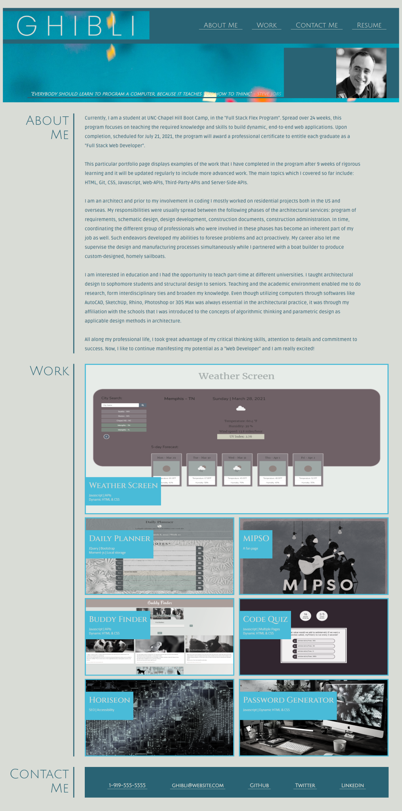

 

## **portfolio ghibli second** 
 

[https://aranata.github.io/portfolio-ghibli-second/](https://aranata.github.io/portfolio-ghibli-second/) 
 
 

## description

***

This is an assignment to create a portfolio page of our own without any starter codebase given. The layout of the 
work was envisioned through wireframe diagrams first and the container tags were assigned accordingly. The codebase 
was semantically organized and accessibility concepts were addressed. It is employing several new tools like flexbox, 
media queries, pseudo elements, CSS variables and absolute positioning. This work was completed by using HTML and 
CSS coding. Best viewed at full screen, 16:10 aspect ratio. 
 

## acceptance criteria

***

The codebase achieves the following criteria: 

* GIVEN I need to sample a potential employee's previous work:
* WHEN I load their portfolio; THEN I am presented with the developer's name, a recent photo, and links to 
sections about them, their work, and how to contact them.
* WHEN I click one of the links in the navigation; THEN the UI scrolls to the corresponding section.
* WHEN I click on the link to the section about their work; THEN the UI scrolls to a section with titled images of 
the developer's applications.
* WHEN I am presented with the developer's first application; THEN that application's image should be larger 
in size than the others.
* WHEN I click on the images of the applications; THEN I am taken to that deployed application.
* WHEN I resize the page or view the site on various screens and devices; THEN I am presented with a responsive 
layout that adapts to my viewport.
 
 

## usage

***

The wireframe diagram: 
 

 
 

A full view screenshot that shows the whole webpage: 
 

 
 

A short video that shows how the UI works, once the video begins please pause and then play again 
to have the app focus right: 
(GitHub did not accept the gif file due to file size.)
 
[https://drive.google.com/file/d/1zgT6CoRxYOPtvVCANgCC7SEaBzQN8bsn/view](https://drive.google.com/file/d/1zgT6CoRxYOPtvVCANgCC7SEaBzQN8bsn/view)
 
 

## some valuable references

***

These links are listing some valuable references among others that I used doing this project:

[https://developer.mozilla.org/en-US/docs/Web/CSS/CSS_Flexible_Box_Layout/Basic_Concepts_of_Flexbox](https://developer.mozilla.org/en-US/docs/Web/CSS/CSS_Flexible_Box_Layout/Basic_Concepts_of_Flexbox)

[https://favicon.io/favicon-generator/](https://favicon.io/favicon-generator/)

[https://css-tricks.com/css-media-queries/](https://css-tricks.com/css-media-queries/)

[https://unsplash.com/](https://unsplash.com/)

[https://shields.io/category/dependencies/](https://shields.io/category/dependencies/)

[https://pixabay.com/](https://pixabay.com/)

[https://www.screencastify.com/](https://www.screencastify.com/)

[https://cloudconvert.com/mp4-to-gif](https://cloudconvert.com/mp4-to-gif)

 
 

## credits

***

Stephen Woosley - Bootcamp Instructor 
Patrick Haberern - Bootcamp TA 
Tim Nagorski - Bootcamp TA 
Sean Walmer - Bootcamp TA 
 
 

## license

***

This is an assigment done under a bootcamp program, it is public but please contact the publisher before you use or 
change any content. 
ghibli.github@gmail.com
 
 

## badges

***

 
 

---
